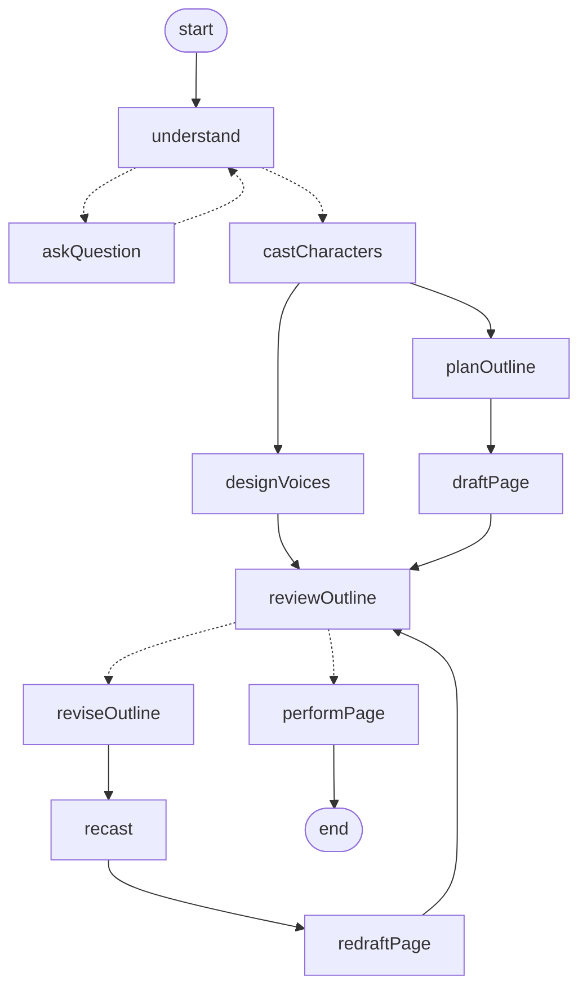

# Seeing the graph: setup, diagram and Studio

Tasks 1–2 of the [task list](langgraph-tasks.md). Everything here is synthetic and runs
without provider credentials. Nothing is traced unless you turn tracing on yourself.

## Setup and baseline

```sh
pnpm install
pnpm check          # baseline 2026-09-25: green, 34 tests (domain 11, app 7, adapters 5, server 11)
```

Synthetic pieces live in `packages/app/dev/`:

| File | Purpose |
| --- | --- |
| `synthetic.ts` | `SyntheticModel` (stateless canned answers: one question, then ready) and `syntheticDeps()`: fake voices, speech and audio store. No files written, no network. |
| `run-synthetic.ts` | Runs one story to completion on `data/learning/checkpoints.sqlite` and prints the checkpoint history. |
| `mermaid.ts` | Regenerates [`story-graph.mmd`](story-graph.mmd) from `buildStoryGraph()`. |
| `studio.ts` | Studio entry point, registered in `packages/app/langgraph.json`. |

`data/learning/` is separate from the server's `data/checkpoints.sqlite`, and `data/` is
gitignored. Never copy real stories or recordings into it.

```sh
pnpm --filter @storytime/app synthetic [thread-id]   # full story, prints pauses and history
pnpm --filter @storytime/app graph:mermaid           # after changing the graph's wiring
```

A test fails if the committed diagram no longer matches the builder.

## The diagram



Solid arrows are static edges; dashed arrows are conditional edges or `Command({ goto })`
destinations declared with `ends`. The generated file is the source of truth; this copy is
simplified for reading.

`designVoices` and `draftPage` both point at `reviewOutline` through a single
`addEdge([...], "reviewOutline")`. That is a *join*: `reviewOutline` waits until both have
run. Two separate edges would instead trigger it twice.

## Studio

```sh
pnpm --filter @storytime/app studio
```

Then open `https://smith.langchain.com/studio?baseUrl=http://localhost:2024` (you need to be
signed in to LangSmith; the graph itself runs locally).

The script runs `@langchain/langgraph-cli@1.5.1` through `npx`, so it adds no dependency. It
warns that it wants `@langchain/langgraph ^1.4.18-rc.0`; version 1.4.17 worked for everything
below, and upgrading is deliberately out of scope.

### Who owns what in the Studio runtime

- **Checkpoints:** the dev server. It attaches its own checkpointer to the graph (persisted
  under `.langgraph_api/`, gitignored), so `studio.ts` compiles *without* one. Threads you
  create in Studio never touch `data/`.
- **Run context:** also the dev server. Each run gets the assistant's JSON context, which
  replaces anything set with `graph.withConfig({ context })`. LangGraph validates context
  against `StoryContext` but passes on the *original* object, so a zod `.default()` cannot
  inject dependencies either.
- **Dependencies:** because model and TTS clients aren't JSON, `studio.ts` builds the graph
  with `buildStoryGraph({ defaultDeps: syntheticDeps() })`. Every node falls back to those
  when the run context has no `deps`. Production never passes `defaultDeps`, and still fails
  loudly if `deps` are missing (covered by a test).

### Walkthrough

In Studio, create a thread with input:

```json
{ "storyId": "synthetic-1", "idea": "Pip builds a rocket out of a bin" }
```

1. **Clarification.** The run stops at `askQuestion` with a `clarification` interrupt.
   Resume with a string, for example `"Moon cheese"`.
2. **Outline review.** `understand` runs again, decides it's ready, then casting, voices,
   outline and page drafting run. The run stops at `reviewOutline` with an `outline_review`
   interrupt titled "First plan".
3. **Revision.** Resume with `{ "approved": false, "feedback": "Make it spookier" }`.
   `reviseOutline → recast → redraftPage` run and you're back at review, now "Revised plan".
4. **Completion.** Resume with `{ "approved": true }`. `performPage` runs and the thread ends
   with four performed segments.

The same sequence through the dev server's HTTP API produced this history (step: next nodes):

```text
-1: __start__   0: understand   1: askQuestion   2: understand   3: castCharacters
 4: designVoices + planOutline   5: draftPage   6: reviewOutline   7: reviseOutline
 8: recast   9: redraftPage   10: reviewOutline   11: performPage   12: (end)
```

### Exercise: predict, then step

Before each resume, write down:

1. Which nodes will run in the same superstep? (Hint: count edges from `castCharacters`.)
2. At step 5 only `draftPage` is next. Where did `designVoices` go, and why doesn't
   `reviewOutline` run in step 5?
3. What does `understand` see in `state.answers` on its second run, and where did that
   update come from?
4. After approval, which nodes will call the model? (Check `model.calls` in the tests, or
   the Studio node outputs.)

Answers:

1. `designVoices` and `planOutline` both run in step 4: they are both triggered by
   `castCharacters` and neither depends on the other.
2. `designVoices` finished in step 4. `draftPage` depends on `planOutline`, so it can only
   run in step 5. The join makes `reviewOutline` wait until `draftPage` has also finished, so
   it runs in step 6.
3. One question-and-answer pair. `askQuestion` returned a `Command` whose `update` appended
   it; nodes only ever see state as of the start of their superstep.
4. None. `performPage` only calls speech synthesis; the page was drafted before review.
