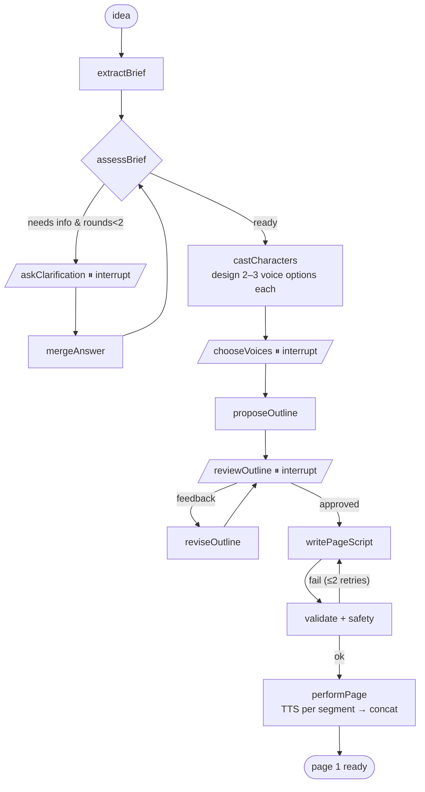

# Storytime — POC plan

_Last updated 2026-09-24. Research notes are in [`research/`](research/)._

## 1. What we're proving

> My daughter speaks a story idea, answers one or two spoken questions, picks her characters' voices, approves a short outline, and then **hears page 1 performed** by a narrator and expressive, funny character voices.

**Success:** she laughs, interrupts to change things, and asks "can I make another one?"
**Not the goal yet:** all six pages, images, a polished UI, production safety, or mobile.

Things to watch in play sessions (write them down; they matter more than any metric):
- Does she smile when a character starts talking?
- Does she care whether a character sounds "right"?
- Does the narrator annoy her?
- Does she want more dialogue?
- Does she want page 2?

**Learning goals (just as important):** use LangGraph.js (state, interrupts, checkpointers, Studio) and LangSmith (tracing, threads, datasets, evals, feedback) the way they're meant to be used.

## 2. Stack (latest versions checked 2026-09-24)

| Concern | Choice |
|---|---|
| Language/runtime | TypeScript 7 (`tsc`) with TypeScript 6 installed alongside for ESLint tooling, Node 22, ESM, following the user's `typescript-setup` skill |
| Monorepo | pnpm 11 workspaces |
| Validation/types | zod 4 (the same schemas are shared by server, web and later mobile) |
| Orchestration | @langchain/langgraph 1.4 (Graph API, StateSchema, interrupts) |
| LLM | @langchain/openrouter behind a `StoryWriter` port; try 2–3 models |
| TTS + voices + STT | @google/genai 2.24 → `gemini-3.8-flash-tts`, Voice Design, `gemini-3.5-transcribe` (Google's Gemini API directly, not OpenRouter) |
| Observability | LangSmith (EU endpoint) + pino structured logs + a folder of files per run |
| Evals | langsmith/vitest + openevals |
| HTTP | Fastify 5 (pino built in) with SSE for progress |
| Web | Vite 8 + React 19 |
| Tests | vitest 5 |
| Persistence | MemorySaver (tests) → SqliteSaver (local) → PostgresSaver (Cloud Run, later) |

## 3. Architecture: ports and adapters

```
             driving adapters                           driven adapters
   ┌──────────────────────────┐              ┌───────────────────────────────────┐
   │ Fastify HTTP + SSE        │              │ StoryWriter    → OpenRouter (LLM) │
   │ CLI (dev/debug)           │──▶ APP ─────▶│ VoiceDesigner  → Gemini voices    │
   │ LangGraph Studio (dev)    │   (graph +   │ SpeechSynth    → Gemini 3.8 TTS   │
   │ Eval runner (vitest)      │    use cases)│ Transcriber    → Gemini Transcribe│
   └──────────────────────────┘              │ AudioStore     → local fs → GCS   │
                                              │ RunRecorder    → run folders      │
          DOMAIN (pure, zod)                  │ SafetyGuard    → rules → Model Armor│
   StoryBrief · Character · VoiceProfile      │ Checkpointer   → sqlite → postgres│
   Outline · PageScript · Segment             │ + a Fake* of every port for tests │
                                              └───────────────────────────────────┘
```

Rules:
- **`domain`** is only zod schemas and pure functions: no LangChain, no SDKs, no I/O. Web and mobile import it.
- **`app`** owns the port interfaces and the LangGraph graph. Nodes are thin: read state → call a port from `config.context` → return an update.
  LangGraph lives here because orchestration is application logic; the domain never imports it.
- **`adapters`** implement the ports. Every adapter is wrapped by two decorators: `logged(port)` (pino) and `traced(port)` (LangSmith `traceable`).
  Business code never logs or traces by hand.
- **Composition root** (`server/src/wiring.ts`) chooses the real or fake adapters from config.
  Studio, the CLI, tests and the server all use the same wiring.

### Repository layout

```
storytime/
├── packages/
│   ├── domain/     # zod schemas: brief, character, outline, page-script; invariants
│   ├── app/        # ports.ts, graph/ (state, nodes, edges), prompts/*.md, use-cases
│   ├── adapters/   # openrouter/, gemini-tts/, gemini-voices/, gemini-stt/, fs-audio/, sqlite/, fakes/
│   ├── server/     # Fastify routes, SSE, wiring.ts, debug routes
│   ├── web/        # Vite + React child UI + /debug viewer
│   └── evals/      # *.eval.ts, datasets/, judges/
├── spikes/voice/   # Phase 0 throwaway script
├── docs/           # this plan, research notes, ADRs
├── runs/           # per-session run folders (gitignored)
├── langgraph.json
└── tsconfig.base.json, eslint.config.mjs, pnpm-workspace.yaml
```

## 4. Domain model (first cut)

```ts
Character   { id, name, role: "hero"|"sidekick"|"villain"|"other",
              personality, comicTrait, catchphrase?, voiceBrief, voiceId? }
StoryBrief  { premise, characters: Character[], setting?, tone,
              childIdeas: string[]  /* must be preserved */, unknowns: string[] }
Outline     { title, pages: OutlinePage[6] }   // OutlinePage { beat, funnyMoment, characters }
PageScript  { page: 1..6, segments: Segment[] }
Segment     { speaker: CharacterId | "narrator", text /* spoken verbatim */,
              style? /* short: "excited whisper" */, }   // vocal tags inline: <giggle>, <gasp>
PerformedSegment = Segment & { audioRef, durationMs }
```

Invariants we test in code:
- exactly 6 outline pages;
- the child's character names are never renamed or dropped;
- every `speaker` is a known character;
- `text` contains no stage directions;
- at most 2 clarification rounds.

## 5. The graph



LangGraph rules we follow (from the research):
- **Every interrupt node does nothing but interrupt.** A node re-runs from the top on resume, so LLM, TTS and voice creation happen in *separate* nodes before the pause.
- The two-question limit is a counter in state plus a conditional edge, not a loop.
- `thread_id` = story session ID (uuid7). It is also used as LangSmith's thread metadata, so a whole story appears as one thread.
- Use `isInterrupted(result)` / `result[INTERRUPT]`; `__interrupt__` isn't in the types.
- Raise `recursionLimit` above the default of 25 because of the revise loop.
- Voice creation is idempotent, keyed by character ID. Delete the voices she didn't pick (the limit is 200 voices per project).

## 6. The part that makes it funny

This is where most of the iteration goes.
- **Character sheet:** one comic trait, an optional catchphrase, and a voice description (age, timbre, accent, energy) → a designed `voice_…` ID. Permanent traits go in the voice design, **not** in `style`.
- **The narrator is a character:** a dry, slightly exasperated narrator who gets interrupted and corrected by the characters.
- **Writer prompt comedy toolkit:**
  - rule of three;
  - callbacks to *her* details;
  - deadpan reactions to absurd things;
  - a running gag;
  - lots of dialogue, short narration.
- **Performance:** keep styles short ("deadpan", "trying to sound brave"). Use tags sparingly (`<snort>`, `<gasp>`, `<long pause>`) and CAPS for emphasis. Too much direction sounds hammy.
- **Variants:** generate 3 versions of page 1 and let her pick. That's fun for her and gives us pairwise preference data.
- **Later:** a separate "audio director" node, compared by eval (does it improve the audio or make it hammy?).

## 7. Observability and debugging

1. **pino** JSON logs, with a child logger per request, carrying `storyId`, `node`, `port` and `durationMs`. Pretty-printed in dev.
2. **LangSmith**:
   - the graph is traced automatically;
   - `traceable` wraps each port adapter, with `processOutputs` stripping the audio bytes (don't rely on `wrapGemini`);
   - the EU endpoint;
   - one thread per story.
3. **Run folders** at `runs/<storyId>/`:
   - `timeline.jsonl`;
   - each prompt, raw LLM response and parsed object;
   - every segment WAV and the page WAV;
   - cost and latency per call.

   You can replay or rerun any single step offline.
4. **`/debug/:storyId` page:** the timeline with audio players inline and a LangSmith trace link.
5. **Studio** (`langgraph-cli dev`): step through interrupts, edit state, branch off from any checkpoint.

## 8. What she sees (web, built to be ported to mobile later)

- **Big hold-to-talk mic.** MediaRecorder captures `audio/webm`, the server transcribes it, and the transcript is shown so she can check it. Typing is available if she prefers.
- **Clarifying question:** read aloud by the narrator's voice and shown as text.
- **Character cards:** colour + emoji avatar, with ▶ auditions of 2–3 voices. "This is Amber. Do you like her voice?"
- **Outline:** 6 simple beat cards, with "Yes!" and "Change something" (by voice).
- **Performance view:** the speaking character's card bounces, their line appears in a speech bubble, and narration is highlighted. Timing comes from per-segment audio durations.
- **😂 / 👍 buttons** send LangSmith feedback via a presigned token (no API key in the browser).
- **Mobile later:** the server does all the work behind a versioned JSON API; audio is served by URL. The client is thin, shares the zod types, and Expo can reuse all of it.

## 9. Phases

| # | Phase | What we build | You learn | Try with her? |
|---|---|---|---|---|
| **0** | **Voice spike** | `spikes/voice`: design 3 voices (narrator + 2 kids), hand-write a funny 60–90s scene as segments, TTS per segment → concat → WAV. Log latency and cost. Confirm Voice Design works from the UK. | @google/genai Interactions API, Voice Design | ✅ **the key test** |
| 1 | Foundations | pnpm monorepo, strict TS + ESLint (skill), domain schemas + invariant tests, port interfaces, fakes, pino, run recorder, CLI shell | typescript-setup, hexagonal architecture | — |
| 2 | Graph on fakes | the full graph with fake ports + MemorySaver; vitest routing/interrupt tests; open it in **Studio** | StateSchema, interrupt/Command, context DI, Studio | — |
| 3 | Real adapters | OpenRouter StoryWriter (withStructuredOutput), Gemini TTS/Voices/Transcribe adapters, SqliteSaver, LangSmith tracing + threads; the CLI plays a full story | structured output, traceable, threads | ✅ via CLI |
| 4 | Make it funny | iterate on writer prompts; 15–25 idea dataset; deterministic evaluators + LLM judges (humour, idea preservation, age fit); pairwise model comparison | datasets, `evaluate`, openevals, Playground | ✅ rate 3 variants |
| 5 | Web UI | Fastify API + SSE, React child UI, mic → transcribe, voice auditions, performance view, 😂 feedback, debug page | streaming, presigned feedback | ✅ **real session** |
| 6 | Play and iterate | play sessions + notes; rate stories in an annotation queue; tune | annotation queues, regression evals | ✅ |
| later | Grow | pages 2–6, streaming audio, audio-director node, images, Cloud Run + Postgres + Secret Manager, Model Armor, Expo app | | |

Phase 0 deliberately skips the architecture, because it answers the riskiest question in an evening.

## 10. Safety and privacy (for the POC)

- Only first names. No surname, school, location, birthday or photos.
- Delete raw mic recordings once transcribed; keep only the text.
- No voice cloning: fictional designed voices only (cloning isn't available in the UK anyway).
- A `SafetyGuard` port from day one: deterministic rules + an LLM check against a written 8–12 story policy. Model Armor later.
- The POC runs locally with a parent present.

## 11. Risks and open questions

- **TTS latency** is unknown: one call per segment × ~15 segments per page. Synthesise segments in parallel and measure in Phase 0. Streaming later if needed.
- **UK availability of Voice Design** has not been verified; check in Phase 0.
- **The skill wants `skipLibCheck: false`**, which LangChain's type definitions may not survive. If they fail, handle it narrowly per the skill (fix it, or scope an exception) and record it in an ADR.
- **`fakeModel().structuredResponse()` doesn't queue answers**, so test with fake *ports* instead.
- **Gemini TTS prices double on 2027-01-01.** Still cents per story.
- **Which story LLM** is decided by the Phase 4 evals plus her laughter.
